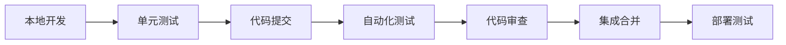

# Rich 大富翁游戏测试开发规划

## 📋 项目概述

基于70个位置的大富翁游戏，制定完整的并行测试开发计划。游戏包含4个角色、多种道具、特殊建筑和复杂的游戏机制。

### 🎯 测试用例总体规划

**测试用例总数：约500个**
- 基础功能测试：80个
- 地图系统测试：120个  
- 道具系统测试：100个
- 特殊建筑测试：80个
- 游戏流程测试：60个
- 边界条件测试：40个
- 性能压力测试：20个

### 👥 团队配置

**测试开发团队（3人）**：
- 张昊楠（测试负责人）
- 岳康（测试开发）
- 柏昱彤（测试开发）

**功能开发团队（4人）**：
- 邵冰沁（开发负责人）
- 李云泽（核心开发）
- 张弛（待分配）
- 吴浩闻（待分配）

## 🚀 并行开发策略

### 核心原则
1. **模块化设计**：每个功能模块独立开发和测试
2. **接口优先**：先定义接口，后实现功能
3. **测试驱动**：测试用例引导开发进度
4. **持续集成**：每日集成测试，及时发现问题
5. **版本控制**：严格的分支管理和代码审查

### 并行开发模式
```
开发阶段    |  测试阶段     |  集成阶段
-----------|-------------|----------
基础框架    |  框架测试    |  每日集成
核心功能    |  功能测试    |  周度集成  
高级功能    |  集成测试    |  版本集成
性能优化    |  性能测试    |  发布集成
```

## 📅 分工和时间安排

### 第1周：项目启动和基础框架

#### 开发分工
- **邵冰沁**：项目架构设计、游戏状态管理、JSON序列化框架
- **李云泽**：角色管理系统、基础移动系统
- **张弛**：地图系统架构、位置管理
- **吴浩闻**：命令解析系统、用户界面框架

#### 测试分工
- **张昊楠**：测试框架搭建、基础测试用例模板、CI/CD配置
- **岳康**：角色选择测试用例（20个）、移动功能测试用例（30个）
- **柏昱彤**：查询功能测试用例（10个）、帮助退出测试用例（10个）

#### 交付目标
- 基础游戏框架可运行
- 角色选择和基础移动功能完成
- 70个基础测试用例完成

### 第2周：核心功能开发

#### 开发分工
- **邵冰沁**：地产购买系统、资金管理系统
- **李云泽**：房产升级系统、过路费计算系统
- **张弛**：道具购买系统、道具屋建筑
- **吴浩闻**：存档系统、游戏状态持久化

#### 测试分工
- **张昊楠**：地产购买测试用例（40个）、集成测试协调
- **岳康**：房产升级测试用例（30个）、过路费测试用例（30个）
- **柏昱彤**：道具购买测试用例（30个）、存档测试用例（20个）

#### 交付目标
- 地产买卖升级功能完成
- 道具购买功能完成
- 150个功能测试用例完成

### 第3周：道具系统开发

#### 开发分工
- **邵冰沁**：路障系统、炸弹系统
- **李云泽**：机器娃娃系统、道具使用框架
- **张弛**：道具效果管理、道具地图显示
- **吴浩闻**：道具状态管理、道具数量限制

#### 测试分工
- **张昊楠**：路障使用测试用例（25个）、道具系统集成测试
- **岳康**：炸弹使用测试用例（25个）、道具效果测试
- **柏昱彤**：机器娃娃测试用例（20个）、道具限制测试

#### 交付目标
- 三种道具完整功能
- 道具使用和效果系统
- 70个道具测试用例完成

### 第4周：特殊建筑开发

#### 开发分工
- **邵冰沁**：医院系统、监狱系统、状态效果管理
- **李云泽**：礼品屋系统、奖励发放系统
- **张弛**：魔法屋系统、特殊效果系统
- **吴浩闻**：矿地系统、点数奖励系统

#### 测试分工
- **张昊楠**：医院监狱测试用例（25个）、特殊建筑集成测试
- **岳康**：礼品屋测试用例（20个）、魔法屋测试用例（15个）
- **柏昱彤**：矿地系统测试用例（20个）、特殊效果测试

#### 交付目标
- 所有特殊建筑功能完成
- 状态效果系统完成
- 80个特殊建筑测试用例完成

### 第5周：游戏流程和结束条件

#### 开发分工
- **邵冰沁**：游戏结束判定、获胜条件、破产处理
- **李云泽**：回合管理、玩家轮换、时间管理
- **张弛**：游戏统计、排名系统、成就系统
- **吴浩闻**：性能优化、内存管理、错误处理

#### 测试分工
- **张昊楠**：完整游戏流程测试（30个）、结束条件测试（30个）
- **岳康**：多玩家协作测试、并发测试、压力测试（20个）
- **柏昱彤**：边界条件测试（40个）、异常处理测试

#### 交付目标
- 完整游戏流程实现
- 所有结束条件处理
- 120个流程和边界测试用例完成

### 第6周：集成测试和优化

#### 开发分工
- **全体开发**：Bug修复、性能优化、代码重构、文档完善

#### 测试分工
- **张昊楠**：系统集成测试、性能测试、测试报告生成
- **岳康**：回归测试、兼容性测试、用户验收测试
- **柏昱彤**：自动化测试优化、测试数据整理、质量评估

#### 交付目标
- 所有功能集成测试通过
- 性能指标达标
- 完整测试报告输出

## 🔧 技术规范

### 开发规范
```bash
# 分支命名规范
feature/player-system      # 功能分支
test/player-movement       # 测试分支
hotfix/critical-bug        # 热修复分支
release/v1.0               # 发布分支

# 提交信息规范
feat: 添加角色选择功能
test: 添加移动功能测试用例
fix: 修复资金计算错误
docs: 更新API文档
```

### 测试规范
```bash
# 测试用例命名规范
test_功能模块_序号_描述

# 示例
test_player_001_single_character_selection
test_move_001_basic_roll_command
test_land_001_empty_land_purchase
```

### 集成规范
```bash
# 每日集成流程
1. 代码合并到 develop 分支
2. 自动化测试执行
3. 测试报告生成
4. 问题反馈和修复
5. 版本标记和发布
```

## 📊 质量控制

### 测试覆盖率要求
- **代码覆盖率**：≥ 85%
- **功能覆盖率**：≥ 95%
- **分支覆盖率**：≥ 80%
- **边界测试覆盖率**：≥ 90%

### 性能指标
- **单个测试用例执行时间**：≤ 10秒
- **完整测试套件执行时间**：≤ 30分钟
- **内存使用**：≤ 100MB
- **并发用户数**：≥ 4人

### 质量门禁
```bash
阶段1：单元测试通过率 ≥ 95%
阶段2：集成测试通过率 ≥ 90%
阶段3：系统测试通过率 ≥ 95%
阶段4：验收测试通过率 ≥ 98%
```

## 📋 详细测试用例分配

### 张昊楠（测试负责人）- 170个测试用例
**负责模块**：游戏框架、地产系统、游戏流程
```bash
# 基础框架测试（20个）
test_startup_001-020: 角色选择和游戏启动

# 地产系统测试（40个）
test_land_001-040: 空地购买、价格计算、所有权

# 游戏流程测试（60个）
test_flow_001-030: 完整游戏流程
test_end_001-030: 游戏结束条件

# 集成测试（50个）
test_integration_001-050: 系统集成、性能测试
```

### 岳康（测试开发）- 165个测试用例
**负责模块**：移动系统、房产系统、道具系统
```bash
# 移动系统测试（30个）
test_move_001-030: 移动命令、位置计算、边界处理

# 房产系统测试（60个）
test_upgrade_001-030: 房产升级
test_toll_001-030: 过路费计算

# 道具系统测试（75个）
test_prop_buy_001-030: 道具购买
test_bomb_001-025: 炸弹使用
test_magic_001-020: 特殊效果
```

### 柏昱彤（测试开发）- 165个测试用例  
**负责模块**：查询系统、特殊建筑、边界测试
```bash
# 查询系统测试（20个）
test_query_001-010: 基础查询
test_help_001-010: 帮助和退出

# 特殊建筑测试（85个）
test_block_001-025: 路障系统
test_robot_001-020: 机器娃娃
test_shop_001-020: 道具屋
test_gift_001-020: 礼品屋

# 边界和异常测试（60个）
test_edge_001-040: 边界条件
test_exception_001-020: 异常处理
```

## 📈 进度跟踪

### 每日站会（Daily Standup）
**时间**：每天上午9:00-9:15
**内容**：
- 昨天完成的工作
- 今天计划的工作  
- 遇到的阻碍和问题
- 需要的帮助和支持

### 周度回顾（Weekly Review）
**时间**：每周五下午4:00-5:00
**内容**：
- 本周进度总结
- 质量指标评估
- 问题分析和改进
- 下周计划调整

### 里程碑检查（Milestone Review）
**时间**：每周结束时
**内容**：
- 交付目标达成情况
- 测试用例通过率统计
- 代码质量评估报告
- 风险识别和应对措施

## 🔄 持续集成流程

### 代码提交流程


### 测试执行流程
```bash
# 1. 触发条件
- 代码提交到主分支
- 定时执行（每日 2:00 AM）
- 手动触发

# 2. 执行步骤
make clean                    # 清理环境
make build                    # 编译程序
make test                     # 执行测试
make report                   # 生成报告
make deploy                   # 部署测试环境

# 3. 结果处理
- 成功：自动合并，通知团队
- 失败：阻止合并，发送警报
- 部分失败：标记风险，人工审查
```

## 🛠️ 工具和环境

### 开发工具
- **IDE**：VS Code / CLion
- **编译器**：GCC 9.0+
- **调试器**：GDB
- **版本控制**：Git + GitHub
- **文档工具**：Markdown + Mermaid

### 测试工具
- **单元测试**：自研测试框架
- **集成测试**：Python 脚本
- **性能测试**：Valgrind + 自制工具
- **覆盖率测试**：gcov
- **静态分析**：cppcheck

### 协作工具
- **项目管理**：GitHub Projects
- **沟通协作**：微信群 + 腾讯会议
- **文档共享**：GitHub Wiki
- **问题跟踪**：GitHub Issues

## 📞 沟通机制

### 紧急问题处理
- **响应时间**：2小时内
- **处理流程**：发现→上报→分析→修复→验证→关闭
- **通知机制**：微信群@相关人员

### 技术讨论
- **定期讨论**：每周三下午技术分享
- **临时讨论**：随时发起，相关人员参与
- **决策记录**：重要技术决策记录到文档

### 进度汇报
- **日报**：每日在群里简要汇报进度
- **周报**：每周五发送详细进度报告
- **月报**：每月总结阶段性成果

## 🎯 成功标准

### 功能完整性
- ✅ 所有计划功能 100% 实现
- ✅ 所有测试用例 95% 以上通过
- ✅ 无严重缺陷，轻微缺陷 < 10个

### 性能指标
- ✅ 游戏响应时间 < 1秒
- ✅ 内存使用 < 100MB
- ✅ 支持4人同时游戏

### 代码质量
- ✅ 代码覆盖率 ≥ 85%
- ✅ 静态检查 0 严重问题
- ✅ 代码审查 100% 覆盖

### 交付标准
- ✅ 完整的可执行程序
- ✅ 完整的测试套件
- ✅ 完整的技术文档
- ✅ 完整的用户手册

---

**项目成功的关键在于团队协作、质量控制和持续改进。让我们一起努力，打造一款高质量的大富翁游戏！**

*文档版本：v1.0*  
*最后更新：2024年9月23日*  
*维护人员：张昊楠*